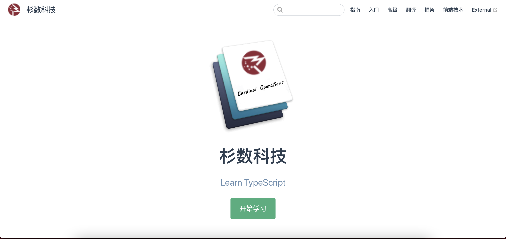
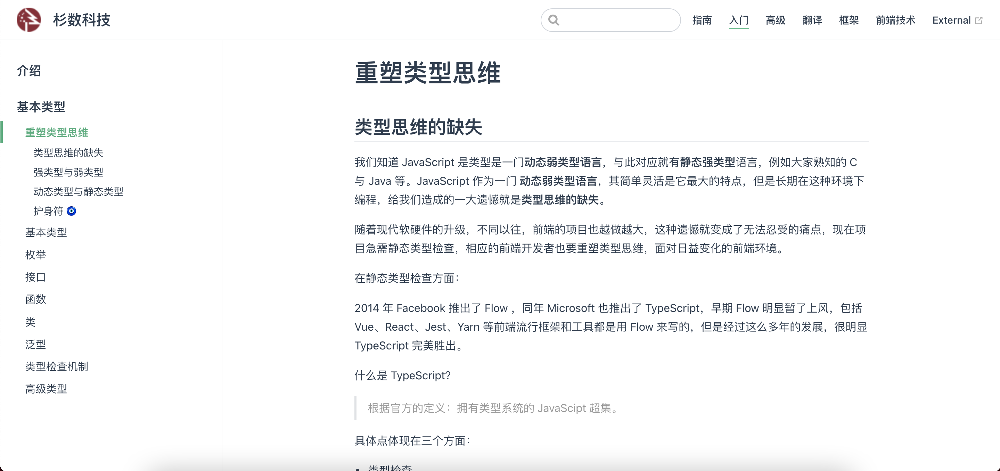
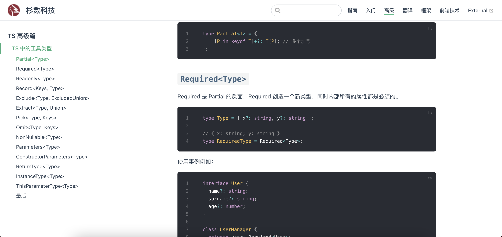
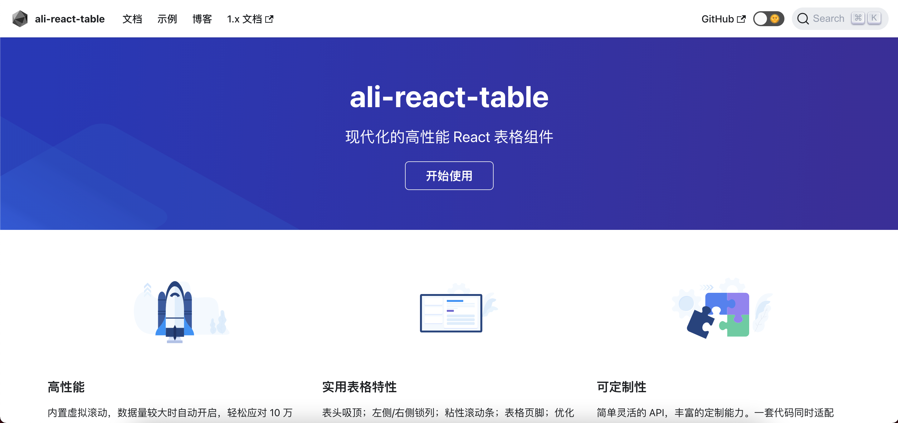

# 李心伟的年中考评

2021-07-05

---

# 回顾过去半年

1. 业务上
2. 技术上

---

# 业务上

> 工期分布：
>    - 三分之二在好丽友二期
>    - 三分之一在好丽友三期

---

# 好丽友二期项目部分展示

---

<!-- .slide: data-background="./images/2021-07-06 00-22-56.2021-07-06 00_29_10.gif" -->

---

# 好丽友三期项目部分展示图

---

<!-- .slide: data-background="./images/2021-07-06_00_52_07.gif" -->

---

# 好丽友三期无限虚拟滚动

采用的是 react-base-table

---

<!-- .slide: data-background="./images/2021-07-06_00_54_04.gif" -->

---

# 技术上

> 半年，当然学了很多的东西，但对团队的贡献主要体现在下面三个方面：

1. 组织三场 TypeScript 分享会，贡献了一份完整的技术文档。

2. 普及了 Web-Components 技术。

3. 彻底解决项目的**虚拟无限**滚动问题。

### 点击链接🔗[什么事无限虚拟滚动](#/8)
<!-- > slogan：比 Vue 更 Vue （写法），比 React 更简单（更贴近原生）。 -->

---

# TypeScript 分享会

> 最大好处：提升了代码的*健壮性*

    <a href="https://condorheroblog.github.io/learn-ts-vuepress/" style="font-size: 16px;" target="_blank">TypeScript 文档</a>

    

        
    

    

        
        
    

---

# 未来规划

自己当然有很多的学习方向，但是对团队来讲两个：

第一个：Vue3 + TS 学习方向

---

## 第二个：ali-react-table 的学习

> 总结： 多学习，多分享。

---

# 最后

致谢：硕哥